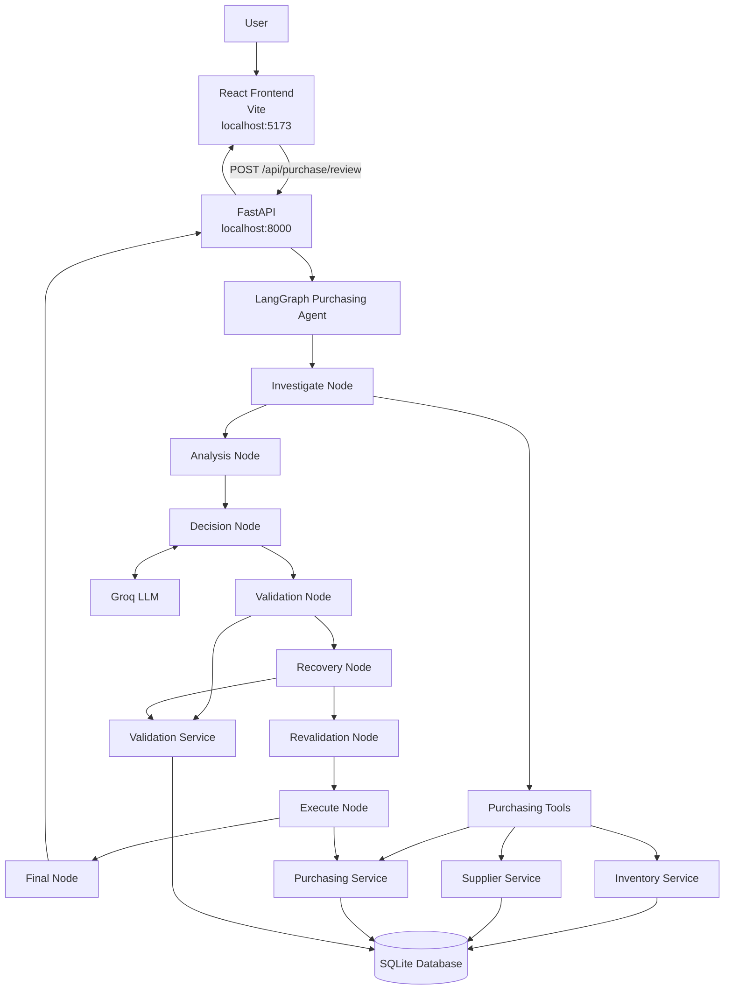
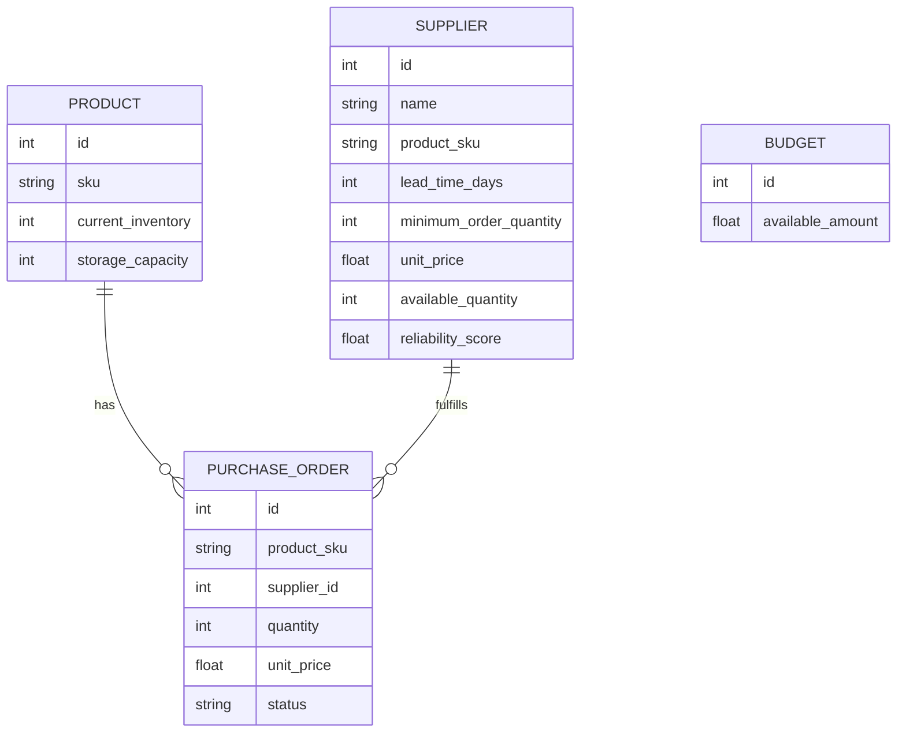
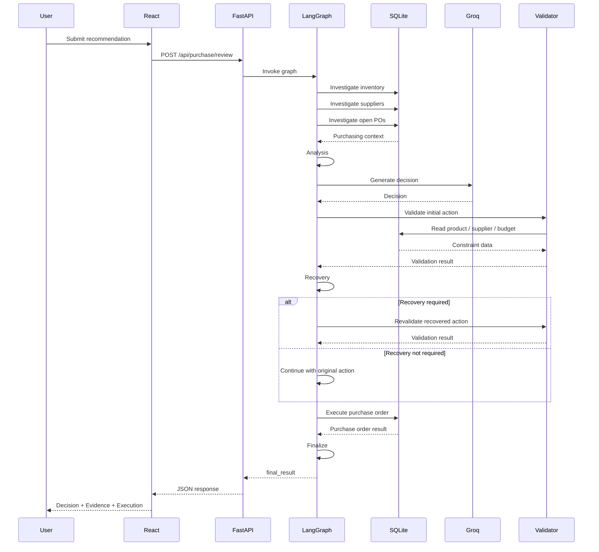

# AI Purchasing Agent — Architecture

## 1. System Overview

The AI Purchasing Agent is a prototype procurement decision system that combines:

* LLM-based purchasing reasoning
* LangGraph stateful orchestration
* Deterministic business-rule validation
* Recovery from failed purchasing actions
* Revalidation before execution
* SQLite-backed purchasing data
* React-based result visualization

The primary end-to-end scenario is **Purchase Recommendation Review**.

The system receives a purchasing recommendation, investigates the available procurement context, analyzes the actual requirement, asks the LLM for a decision, validates the proposed action using deterministic rules, attempts recovery when the action is infeasible, revalidates the recovered action, executes the purchase order, and returns the final result.

---

# 2. Actual Agent Graph

The current LangGraph implementation is located at:

```text
backend/app/agent/graph.py
```

The actual workflow is:

```text
┌──────────────────┐
│    Investigate   │
└────────┬─────────┘
         ↓
┌──────────────────┐
│     Analysis     │
└────────┬─────────┘
         ↓
┌──────────────────┐
│      Decision    │
│     Groq LLM     │
└────────┬─────────┘
         ↓
┌──────────────────┐
│    Validation    │
└────────┬─────────┘
         ↓
┌──────────────────┐
│     Recovery     │
│                  │
│ Decides whether  │
│ recovery is      │
│ required         │
└────────┬─────────┘
         ↓
┌──────────────────┐
│   Revalidation   │
└────────┬─────────┘
         ↓
┌──────────────────┐
│     Execute      │
└────────┬─────────┘
         ↓
┌──────────────────┐
│      Final       │
└──────────────────┘
```

### Important implementation detail

The graph currently uses a **linear sequence of nodes** rather than conditional LangGraph edges.

In other words, validation does not directly branch to either execution or recovery.

Instead:

```text
Validation
    ↓
Recovery
    ↓
Revalidation
    ↓
Execution
```

The recovery node examines the validation result and determines whether recovery was necessary.

This matches the current implementation in `graph.py`.

---

# 3. High-Level System Architecture



---

# 4. Application Layers

The system is separated into the following layers:

```text
┌─────────────────────────────────────────────┐
│              React Frontend                 │
├─────────────────────────────────────────────┤
│                  FastAPI                    │
├─────────────────────────────────────────────┤
│               LangGraph Agent               │
├─────────────────────────────────────────────┤
│             Tools / Services                │
├─────────────────────────────────────────────┤
│             SQLAlchemy / SQLite             │
└─────────────────────────────────────────────┘
                       │
                       ▼
                  Groq LLM
```

Each layer has a separate responsibility.

---

# 5. Frontend Architecture

The frontend is implemented using React and Vite.

```text
frontend/
│
├── index.html
├── package.json
├── vite.config.js
│
└── src/
    ├── main.jsx
    ├── App.jsx
    ├── index.css
    │
    └── components/
        ├── ScenarioSelector.jsx
        ├── PurchaseForm.jsx
        ├── DecisionCard.jsx
        └── EvidencePanel.jsx
```

## Responsibilities

### `App.jsx`

The main application controller.

It manages:

* Selected scenario
* Loading state
* API request
* API errors
* Agent result
* Result rendering

The frontend sends:

```http
POST /api/purchase/review
```

---

### `ScenarioSelector.jsx`

Displays the available purchasing scenarios:

1. Purchase Recommendation Review
2. Supplier Cannot Fulfil Purchase
3. Demand / Forecast Changed
4. Purchasing Constraint

The fully demonstrated end-to-end scenario is Scenario 01.

---

### `PurchaseForm.jsx`

Collects the purchase recommendation:

* Product SKU
* Recommended quantity
* Recommendation reason

Example:

```json
{
  "product_sku": "COFFEE-001",
  "recommended_quantity": 800,
  "reason": "Forecast indicates increased demand and additional inventory is recommended."
}
```

---

### `DecisionCard.jsx`

Displays the main agent decision:

* Decision
* Final quantity
* Supplier
* Required additional inventory
* Original recommendation
* Reasoning
* Risk

---

### `EvidencePanel.jsx`

Displays supporting evidence:

* Validation checks
* Total cost
* Available budget
* Recovery information
* Execution result

---

# 6. FastAPI Layer

The FastAPI application is implemented in:

```text
backend/app/main.py
```

The primary endpoint is:

```http
POST /api/purchase/review
```

The request schema is:

```python
class PurchaseRequest(BaseModel):
    product_sku: str
    recommended_quantity: int
    reason: str
```

The API performs the following:

```text
HTTP Request
     ↓
Validate request schema
     ↓
Create purchasing graph
     ↓
Invoke graph
     ↓
Receive final_result
     ↓
Return JSON response
```

The API does not itself make purchasing decisions.

The decision workflow is delegated to LangGraph.

---

# 7. LangGraph State

The graph state is defined in:

```text
backend/app/agent/state.py
```

The state contains information such as:

```text
product_sku
recommended_quantity
reason

purchase_order_quantity
supplier_name
supplier_available_quantity

previous_forecast
new_forecast
current_inventory
existing_purchase_order

budget
storage_capacity

inventory
suppliers
purchase_orders

analysis
decision

selected_supplier_id
approved_quantity

validation
recovery
action

final_result
```

The state allows information gathered in earlier nodes to be used by later nodes.

---

# 8. Node 1 — Investigate

The first graph node is the investigation stage.

Its purpose is to gather the information required to make a purchasing decision.

It uses:

```text
backend/app/tools/purchasing_tools.py
```

The investigation gathers:

### Inventory

* Current inventory
* Required demand
* Storage capacity

### Suppliers

* Supplier ID
* Supplier name
* Lead time
* MOQ
* Unit price
* Available quantity
* Reliability score

### Purchase Orders

* Existing open POs
* Supplier
* Quantity
* Unit price
* Status

The result is stored in the graph state.

---

# 9. Node 2 — Analysis

The analysis node determines the actual purchasing requirement from the investigated context.

For the primary scenario:

```text
Current inventory = 300
Incoming PO = 100
Required demand = 1000
```

Therefore:

```text
Additional requirement
= Required demand
  - Current inventory
  - Incoming purchase orders

= 1000 - 300 - 100

= 600 units
```

The analysis stage therefore identifies that the business needs an additional 600 units rather than blindly accepting the original recommendation of 800 units.

---

# 10. Node 3 — Decision

The decision node uses the Groq LLM to determine the purchasing action.

The LLM receives the relevant purchasing context and produces a structured decision.

The decision can include:

```text
decision
quantity
supplier
reasoning
risk
```

Possible decision values include:

```text
ACCEPT
MODIFY
REJECT
INVESTIGATE
```

The LLM provides the reasoning layer.

It does not directly execute database operations.

---

# 11. LLM Responsibility

The LLM is responsible for interpreting the procurement context.

For example:

```text
Original recommendation = 800
Actual additional need = 600
```

The model can determine that the recommendation should be modified.

However, the LLM does not have final authority over constraints such as:

* Budget
* MOQ
* Supplier capacity
* Storage capacity

Those constraints are enforced by deterministic application code.

Therefore:

```text
LLM
 ↓
Proposes purchasing action
 ↓
Deterministic validation
 ↓
Only valid action can execute
```

---

# 12. Node 4 — Validation

The validation node calls the deterministic validation service:

```text
backend/app/services/validation.py
```

The validator checks:

1. Minimum order quantity
2. Supplier capacity
3. Storage capacity
4. Budget

---

## Minimum Order Quantity

```text
quantity >= supplier.minimum_order_quantity
```

---

## Supplier Capacity

```text
quantity <= supplier.available_quantity
```

---

## Storage Capacity

```text
current_inventory + incoming_quantity + quantity
<= storage_capacity
```

---

## Budget

```text
quantity × supplier.unit_price
<= available_budget
```

The validation result is stored in the graph state.

It contains information such as:

```text
valid
checks
total_cost
available_budget
failed_checks
reason
```

---

# 13. Node 5 — Recovery

The recovery node is always reached after validation because the current graph is linear.

Its job is to determine whether recovery is necessary.

Conceptually:

```text
Validation Result
       ↓
Recovery Node
       │
       ├── Validation already passed
       │       ↓
       │   No recovery
       │
       └── Validation failed
               ↓
           Find feasible alternative
```

### If validation passes

The recovery node records that recovery was not required.

Example:

```json
{
  "attempted": false,
  "reason": "Initial validation passed"
}
```

The original valid action continues through the remaining graph nodes.

---

### If validation fails

The recovery node searches for a feasible purchasing alternative.

It evaluates available suppliers against:

* Supplier capacity
* Supplier MOQ
* Budget
* Storage capacity
* Required quantity
* Unit price

It calculates the maximum feasible quantity for each supplier.

---

# 14. Recovery Algorithm

For each supplier, the recovery logic determines:

```text
Budget-limited quantity
= available budget / supplier unit price
```

```text
Storage-limited quantity
= storage capacity - current inventory - incoming quantity
```

```text
Maximum feasible quantity
= minimum(
    supplier available quantity,
    budget-limited quantity,
    storage-limited quantity
)
```

Suppliers that cannot satisfy their MOQ are ignored.

The remaining feasible options are ranked according to how closely they satisfy the required quantity, with cost used as a secondary consideration.

The selected alternative is then written back into the decision state.

---

# 15. Primary Recovery Example

The primary demonstration starts with:

```text
Original recommendation = 800
Additional requirement = 600
Supplier A price = ₹10
Available budget = ₹5,000
```

The initial proposed purchase is:

```text
600 units
```

Cost:

```text
600 × ₹10
= ₹6,000
```

Budget:

```text
₹5,000
```

Therefore:

```text
₹6,000 > ₹5,000
```

The validation fails.

The recovery node then calculates:

```text
₹5,000 / ₹10
= 500 units
```

Therefore the recovered action is:

```text
500 units from Supplier A
```

The recovery state records:

```text
attempted = true

recovered quantity = 500

remaining shortfall = 100
```

---

# 16. Node 6 — Revalidation

After the recovery node, the graph always proceeds to the revalidation node.

This is an important safety step.

The recovered action is sent through deterministic validation again.

```text
Recovery
   ↓
Recovered action
   ↓
Revalidation
```

For the primary scenario:

```text
Minimum Order Quantity    PASS
Supplier Capacity         PASS
Storage Capacity          PASS
Budget                    PASS
```

The recovered purchase is therefore safe to execute.

---

# 17. Why Revalidation Exists

Recovery changes the purchasing action.

For example:

```text
Initial action:
600 units
```

becomes:

```text
Recovered action:
500 units
```

Because the action changed, it must be validated again.

This prevents the recovery logic from accidentally bypassing the same purchasing constraints applied to the original action.

The architecture therefore follows:

```text
Propose
  ↓
Validate
  ↓
Recover
  ↓
Validate Again
  ↓
Execute
```

---

# 18. Node 7 — Execute

The execute node is responsible for purchase-order creation.

It uses the purchasing service:

```text
backend/app/services/purchasing.py
```

The purchasing service creates a `PurchaseOrder` record only after the action has passed through the validation/revalidation workflow.

The resulting PO contains:

```text
Product SKU
Supplier ID
Quantity
Unit price
Status
```

For the demonstrated scenario:

```text
Supplier: Supplier 1
Quantity: 500
Unit price: ₹10
Total: ₹5,000
Status: OPEN
```

---

# 19. Node 8 — Final

The final node constructs the response returned to the API.

The final result combines information from the graph state, including:

```text
Decision
Quantity
Supplier
Original recommendation
Required additional quantity
Reasoning
Risk
Validation
Recovery
Execution
```

The FastAPI endpoint returns this final result to the React frontend.

---

# 20. Actual End-to-End Flow

The actual graph for Scenario 01 is:

```text
User submits 800-unit recommendation
              │
              ▼
        ┌─────────────┐
        │ Investigate │
        └──────┬──────┘
               ▼
        ┌─────────────┐
        │   Analysis  │
        └──────┬──────┘
               ▼
        ┌─────────────┐
        │   Decision  │
        │   Groq LLM  │
        └──────┬──────┘
               ▼
        ┌─────────────┐
        │  Validation │
        └──────┬──────┘
               ▼
        ┌─────────────┐
        │   Recovery  │
        └──────┬──────┘
               ▼
        ┌─────────────┐
        │ Revalidation│
        └──────┬──────┘
               ▼
        ┌─────────────┐
        │   Execute   │
        └──────┬──────┘
               ▼
        ┌─────────────┐
        │    Final    │
        └─────────────┘
```

The important distinction is that **Recovery is a node in the linear graph, not a conditional branch edge in the current implementation.**

---

# 21. Actual Scenario Execution

The primary scenario starts with:

```text
Product SKU: COFFEE-001
Recommended quantity: 800
```

Investigation returns:

```text
Current inventory: 300
Incoming PO: 100
Required demand: 1000
```

Analysis determines:

```text
Additional required = 600
```

The decision stage proposes a purchase based on this context.

The initial validation identifies that purchasing 600 units from Supplier A would cost:

```text
600 × ₹10
= ₹6,000
```

while the available budget is:

```text
₹5,000
```

Therefore the initial action fails budget validation.

Recovery finds:

```text
500 units × ₹10
= ₹5,000
```

The recovered action passes all validation checks.

The execute node creates the purchase order.

The final result reports:

```text
Decision: MODIFY
Original recommendation: 800
Required additional: 600
Recovered purchase: 500
Remaining shortfall: 100
Total cost: ₹5,000
```

---

# 22. Service and Tool Architecture

```text
backend/app/
│
├── agent/
│   ├── graph.py
│   ├── state.py
│   └── prompts.py
│
├── services/
│   ├── inventory.py
│   ├── suppliers.py
│   ├── purchasing.py
│   └── validation.py
│
└── tools/
    └── purchasing_tools.py
```

The separation is:

```text
Agent
  ↓
Tools
  ↓
Services
  ↓
Database
```

The agent should not contain raw database logic wherever a service abstraction is appropriate.

---

# 23. Tool Layer

The agent-facing tools are implemented in:

```text
backend/app/tools/purchasing_tools.py
```

Current responsibilities include:

### `investigate_product()`

Combines:

* Inventory context
* Supplier options
* Open purchase orders

into one purchasing context.

### `validate_purchase_action()`

Calls the deterministic purchasing validator.

This gives the agent graph a clean interface to the underlying services.

---

# 24. Inventory Service

Implemented in:

```text
backend/app/services/inventory.py
```

The inventory service retrieves the product's purchasing context, including the information required to calculate whether additional inventory is required.

---

# 25. Supplier Service

Implemented in:

```text
backend/app/services/suppliers.py
```

It retrieves supplier options for a product.

Supplier information includes:

```text
supplier_id
supplier_name
lead_time_days
minimum_order_quantity
unit_price
available_quantity
reliability_score
```

---

# 26. Purchasing Service

Implemented in:

```text
backend/app/services/purchasing.py
```

Responsibilities:

* Retrieve open purchase orders
* Create purchase orders

The service handles the database mutation required to create a PO.

---

# 27. Validation Service

Implemented in:

```text
backend/app/services/validation.py
```

This service provides deterministic checks for:

```text
MOQ
Supplier capacity
Storage capacity
Budget
```

The validation result is stored in the LangGraph state and surfaced to the frontend.

---

# 28. Database Architecture

The prototype uses:

```text
SQLite
+
SQLAlchemy
```

The database file is:

```text
backend/purchasing.db
```

The seeded database contains mock procurement data.

The main entities are:

```text
Product
Supplier
PurchaseOrder
Budget
```

---

# 29. Database Relationships



---

# 30. Request-to-Response Sequence



---

# 31. Deterministic Safety Boundary

The architecture deliberately separates LLM reasoning from deterministic execution.

```text
                 ┌───────────────┐
                 │    Groq LLM   │
                 │               │
                 │   Reasoning   │
                 │   Decision    │
                 └───────┬───────┘
                         │
                         │ proposed action
                         ▼
                 ┌───────────────┐
                 │  Validation   │
                 │               │
                 │ MOQ           │
                 │ Capacity      │
                 │ Storage       │
                 │ Budget        │
                 └───────┬───────┘
                         │
                         │ valid
                         ▼
                 ┌───────────────┐
                 │    Execute    │
                 │               │
                 │ Create PO     │
                 └───────────────┘
```

The LLM does not directly create the purchase order.

The purchasing service performs the database mutation.

---

# 32. Why Recovery Is Separate from Validation

Validation answers:

> "Is this proposed purchase allowed?"

Recovery answers:

> "If it is not allowed, can we find a feasible alternative?"

For example:

```text
Proposed:
600 units

Validation:
FAIL

Recovery:
Find feasible quantity

Result:
500 units

Revalidation:
PASS
```

This separation makes the workflow easier to reason about and test.

---

# 33. Why Revalidation Is Required

Recovery modifies the action.

Therefore the system must not assume that the recovery result is valid.

Instead:

```text
Original Action
      ↓
Validation
      ↓
Failure
      ↓
Recovery
      ↓
New Action
      ↓
Revalidation
      ↓
Execution
```

This ensures that all final purchasing actions pass the same deterministic constraints.

---

# 34. Primary Scenario Data Flow

```text
Recommendation
800 units
      │
      ▼
Investigation
      │
      ├── Inventory = 300
      ├── Incoming PO = 100
      ├── Demand = 1000
      └── Suppliers
      │
      ▼
Analysis
      │
      └── Additional requirement = 600
      │
      ▼
Groq Decision
      │
      └── Proposed purchase
      │
      ▼
Validation
      │
      └── 600 × ₹10 = ₹6000
          Budget = ₹5000
          FAIL
      │
      ▼
Recovery
      │
      └── Maximum feasible = 500
      │
      ▼
Revalidation
      │
      ├── MOQ PASS
      ├── Capacity PASS
      ├── Storage PASS
      └── Budget PASS
      │
      ▼
Execution
      │
      └── Create PO for 500
      │
      ▼
Final
      │
      └── 100-unit shortfall reported
```

---

# 35. Current Scope

The project prioritizes one reliable end-to-end purchasing workflow:

**Purchase Recommendation Review**

The UI exposes four scenarios:

1. Purchase Recommendation Review
2. Supplier Cannot Fulfil Purchase
3. Demand / Forecast Changed
4. Purchasing Constraint

The architecture is designed so that the additional scenarios can reuse:

* The LangGraph state
* Investigation tools
* Supplier services
* Inventory services
* Validation services
* Purchasing services

The current submission focuses on the fully demonstrated Scenario 01 because the assignment requires at least one scenario to work end-to-end.

---

# 36. Production Evolution

The current prototype:

```text
React
   ↓
FastAPI
   ↓
LangGraph
   ↓
Services
   ↓
SQLite
```

could evolve into:

```text
React
   ↓
API Gateway
   ↓
FastAPI
   ↓
LangGraph Orchestrator
   │
   ├── Inventory Service
   ├── Supplier Service
   ├── Forecast Service
   ├── Budget Service
   └── Purchasing Service
           │
           ▼
     ERP / Procurement System
```

Potential production improvements include:

* PostgreSQL
* Authentication
* Role-based authorization
* Human approval workflows
* Real supplier APIs
* Real inventory systems
* ERP integration
* Audit logging
* Observability
* Distributed task execution
* Real-time inventory synchronization

---

# 37. Architectural Principles

## LLM for reasoning

The LLM handles contextual reasoning and decision explanation.

## Deterministic code for constraints

Financial and operational rules are enforced by application code.

## Recovery instead of blind rejection

A failed action can be adjusted when a feasible alternative exists.

## Revalidation before execution

Recovered actions are validated again.

## Service isolation

Database operations are kept in service modules rather than inside the LLM.

## Explainability

The final result exposes:

* Decision
* Reasoning
* Validation
* Recovery
* Risk
* Execution

## Reproducibility

Seeded SQLite data makes the primary demonstration easy to reproduce locally.

---

# 38. Final Architecture

The actual current architecture can be summarized as:

```text
                         USER
                           │
                           ▼
                  ┌────────────────┐
                  │  React / Vite  │
                  └───────┬────────┘
                          │
                          │ POST /api/purchase/review
                          ▼
                  ┌────────────────┐
                  │    FastAPI     │
                  └───────┬────────┘
                          │
                          ▼
        ┌─────────────────────────────────┐
        │          LANGGRAPH              │
        │                                 │
        │  Investigate                    │
        │       ↓                         │
        │  Analysis                       │
        │       ↓                         │
        │  Decision ←──── Groq            │
        │       ↓                         │
        │  Validation                     │
        │       ↓                         │
        │  Recovery                       │
        │       ↓                         │
        │  Revalidation                   │
        │       ↓                         │
        │  Execute                        │
        │       ↓                         │
        │  Final                          │
        └──────────────┬──────────────────┘
                       │
          ┌────────────┼─────────────┐
          │            │             │
          ▼            ▼             ▼
     Inventory     Suppliers    Purchasing
      Service       Service       Service
          │            │             │
          └────────────┼─────────────┘
                       ▼
                 ┌────────────┐
                 │  SQLite DB │
                 └────────────┘
                       ▲
                       │
                 ┌────────────┐
                 │ Validation │
                 │  Service   │
                 └────────────┘
```

The key workflow is therefore:

```text
Investigate
    ↓
Analysis
    ↓
AI Decision
    ↓
Deterministic Validation
    ↓
Recovery
    ↓
Revalidation
    ↓
Execution
    ↓
Final Result
```

This reflects the **actual current LangGraph implementation**, including the fact that recovery and revalidation are explicit nodes in the linear graph rather than conditional graph branches.
